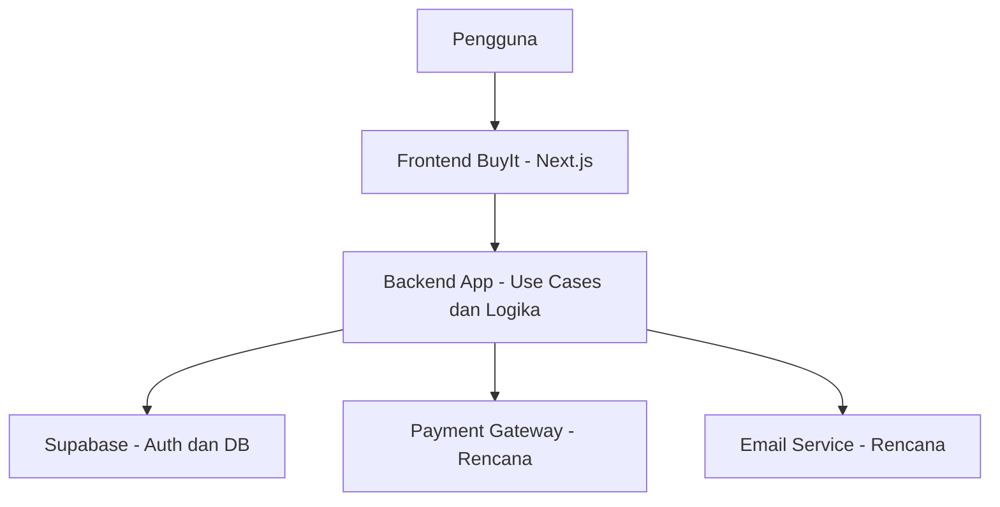
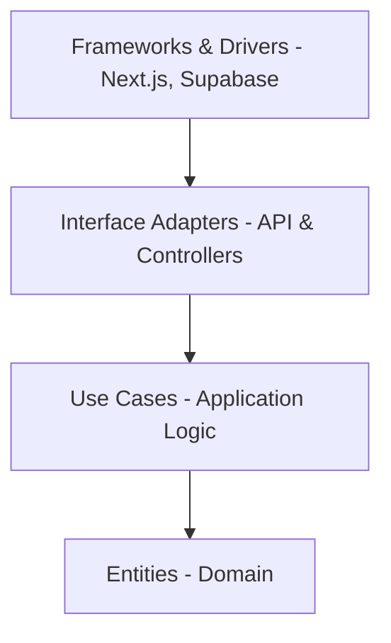
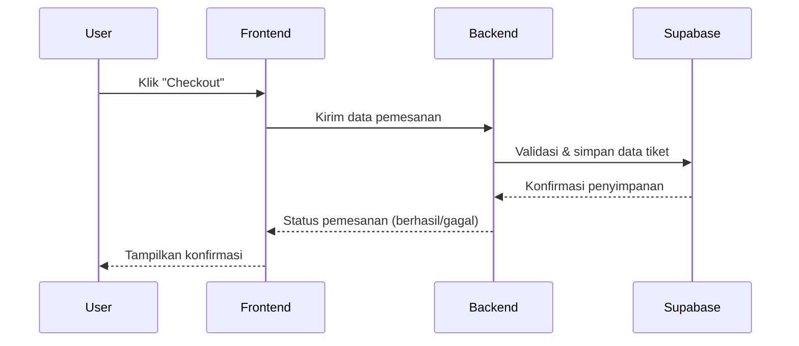
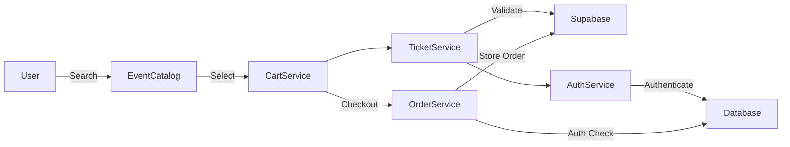
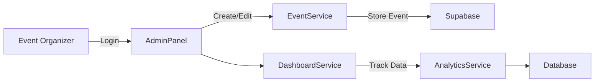

# BuyIt – Web E-Commerce Platform for Event Ticketing

BuyIt adalah sebuah platform digital berbasis web yang dirancang untuk memfasilitasi proses penjualan dan distribusi tiket acara seperti konser, seminar, bootcamp, dan pameran.
Apabila you penasaran dengan dokumentasi arc42-nya, klik link berikut  Klik [:3](https://docs.google.com/document/d/1h9t22fyRit858Dz_-mGAcl4kly9ew7ldRTk748H_vR0/edit?usp=sharing) untuk melihat dokumentasi drivenya lebih lengkap

Website yang sudah di deployment juga bisa kamu kunjungin nih klik [disini](https://final-project-buy-it.vercel.app/)

---

## Goals

BuyIt bertujuan untuk:
- Menyediakan platform terpusat bagi penyelenggara dalam mengelola dan memasarkan tiket acara.
- Memudahkan pengguna menemukan, memesan, dan membayar tiket acara secara cepat dan nyaman.
- Meningkatkan transparansi dan aksesibilitas acara digital.

---

## Fitur Utama

- Katalog acara berdasarkan kategori dan waktu
- Sistem keranjang dan checkout
- Simulasi pembayaran (dan ekspansi ke payment gateway)
- Riwayat pesanan dan status tiket

---

## Arsitektur Sistem

Sistem dibangun menggunakan pendekatan Clean Architecture dan monorepo berbasis Next.js App Router dengan SSR. Backend terintegrasi dengan Supabase untuk autentikasi dan database.

---

## Clean Architecture View (Model Bawang) hehe 

Struktur arsitektur BuyIt mengikuti Clean Architecture model bawang, dengan arah dependensi ke dalam:

- **Entities**: Inti dari sistem, berisi model bisnis dan aturan utama.
- **Use Cases**: Menentukan proses bisnis yang bisa terjadi.
- **Interface Adapters**: Menyesuaikan input/output agar cocok dengan Use Cases.
- **Frameworks & Drivers**: Teknologi eksternal seperti Next.js, Supabase, dan integrasi lainnya.

---

## Sequence Diagram: Alur Checkout Tiket

---

## Data Flow Context

###  User Journey (Pemesanan Tiket)

**Penjelasan Alur:**
- Pengguna mencari acara melalui `EventCatalog`.
- Tiket yang dipilih dimasukkan ke `CartService`, lalu diproses ke `OrderService`.
- Sebelum pemesanan diproses, sistem memvalidasi tiket melalui `TicketService`, yang terhubung ke `Supabase` dan `AuthService`.
- Transaksi disimpan ke `Supabase` setelah validasi berhasil dan user terautentikasi.

---

### Admin Journey (Pengelolaan Event)

**Penjelasan Alur:**
- Penyelenggara masuk melalui `AdminPanel`, kemudian membuat atau mengedit event lewat `EventService`.
- Data acara disimpan ke `Supabase`.
- Aktivitas pengguna, statistik penjualan, dan performa tiket dipantau via `DashboardService`, lalu dikirim ke `AnalyticsService` untuk dicatat dalam `Database`.

---

### Rangkuman Komponen

| Komponen             | Fungsi                                                                 |
|----------------------|------------------------------------------------------------------------|
| `EventCatalog`       | Menyediakan daftar acara yang tersedia                                 |
| `CartService`        | Menyimpan pilihan tiket sementara                                       |
| `OrderService`       | Menangani proses transaksi checkout                                     |
| `TicketService`      | Memvalidasi ketersediaan dan status tiket                               |
| `AuthService`        | Memverifikasi identitas pengguna/admin                                  |
| `AdminPanel`         | Antarmuka untuk penyelenggara mengelola acara                          |
| `DashboardService`   | Menyediakan data real-time ke penyelenggara                             |
| `AnalyticsService`   | Menganalisis performa event dan aktivitas pengguna                      |

---

## Quality Objectives

| Quality Attribute | Deskripsi |
|-------------------|-----------|
| Reliability | Menjamin keandalan transaksi & mencegah double-booking. |
| Usability | UI responsif, alur pemesanan minimal langkah. |
| Performance | Respon cepat dengan caching dan SSR. |
| Security | HTTPS, otentikasi JWT, dan validasi endpoint. |

---

## Constraints

- Framework: Next.js + TypeScript
- Backend: Clean Architecture modular
- Deployment: Vercel + Supabase
- DB & Auth: Supabase
- Build: ESLint, Tailwind, PostCSS

---

## Stakeholders

| Peran | Ekspektasi |
|-------|------------|
| Pengguna Akhir | Navigasi acara dan beli tiket dengan mudah & aman |
| Developer | Struktur modular & mudah di-maintain |
| QA | Sistem dapat diuji otomatis dan manual |
| Admin Sistem | Stabilitas dan monitoring performa sistem |

---

## Struktur Folder

- `/app` — halaman frontend, API route
- `/app/api/*` — endpoint modular (addticket, bookticket, dll)
- `/supabase` — konfigurasi autentikasi & klien database

---

## Contoh Skenario Kualitas

- **Reliability**: Dua pengguna memesan tiket terakhir, hanya satu berhasil.
- **Performance**: 500 pengguna akses halaman — tetap <200ms (dengan caching).
- **Security**: Akses ilegal diblok dengan verifikasi JWT.
- **Usability**: Pembelian tiket maksimal 3 langkah dari mobile.

---

## Risiko & Utang Teknis

| Risiko | Dampak | Mitigasi |
|--------|--------|----------|
| Ketergantungan pada Supabase | Tinggi | Evaluasi alternatif open-source |
| Bottleneck traffic | Tinggi | Implementasi SSR & caching |
| Kurangnya dokumentasi/test | Sedang | Tambah test & dokumentasi internal |

---

## Glosarium

- **Entity**: Objek bisnis (User, Ticket, Event)
- **Use Case**: Skenario interaksi pengguna
- **Supabase**: Layanan backend (Auth, DB, API)
- **DTO**: Format pertukaran data antar-layer
- **SSR**: Server-Side Rendering
