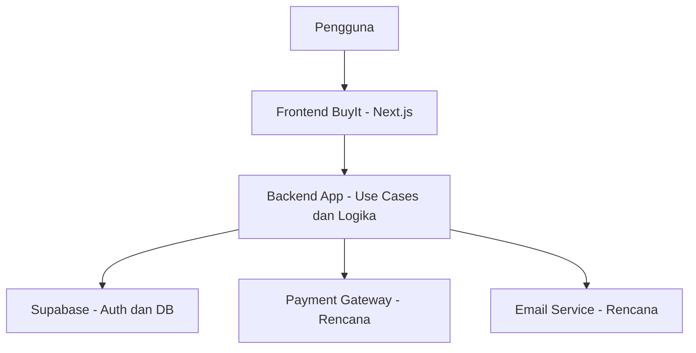
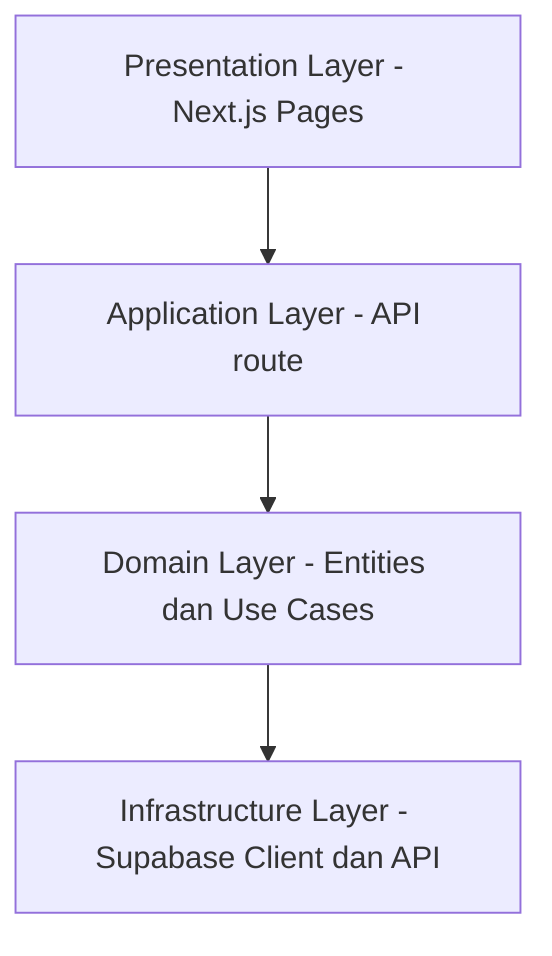
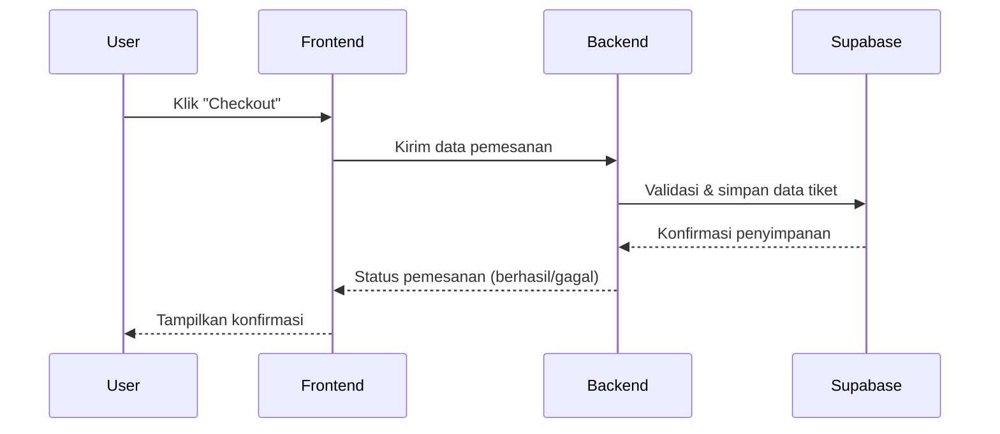

# BuyIt – Web E-Commerce Platform for Event Ticketing

BuyIt adalah sebuah platform digital berbasis web yang dirancang untuk memfasilitasi proses penjualan dan distribusi tiket acara seperti konser, seminar, bootcamp, dan pameran.

---

## 🎯 Goals

BuyIt bertujuan untuk:
- Menyediakan platform terpusat bagi penyelenggara dalam mengelola dan memasarkan tiket acara.
- Memudahkan pengguna menemukan, memesan, dan membayar tiket acara secara cepat dan nyaman.
- Meningkatkan transparansi dan aksesibilitas acara digital.

---

## ✨ Fitur Utama

- Katalog acara berdasarkan kategori dan waktu
- Sistem keranjang dan checkout
- Simulasi pembayaran (dan ekspansi ke payment gateway)
- Riwayat pesanan dan status tiket

---

## 🏗️ Arsitektur Sistem

Sistem dibangun menggunakan pendekatan Clean Architecture dan monorepo berbasis Next.js App Router dengan SSR. Backend terintegrasi dengan Supabase untuk autentikasi dan database.

---

## 🧱 Clean Architecture View

Struktur arsitektur dibagi dalam 4 layer utama:

---

## 🔁 Sequence Diagram: Alur Checkout Tiket

Berikut ilustrasi proses saat pengguna melakukan checkout tiket:

---

## 🔐 Quality Objectives

| Quality Attribute | Deskripsi |
|-------------------|-----------|
| Reliability | Menjamin keandalan transaksi & mencegah double-booking. |
| Usability | UI responsif, alur pemesanan minimal langkah. |
| Performance | Respon cepat dengan caching dan SSR. |
| Security | HTTPS, otentikasi JWT, dan validasi endpoint. |

---

## 📌 Constraints

- Framework: Next.js + TypeScript
- Backend: Clean Architecture modular
- Deployment: Vercel + Supabase
- DB & Auth: Supabase
- Build: ESLint, Tailwind, PostCSS

---

## 🧑‍💼 Stakeholders

| Peran | Ekspektasi |
|-------|------------|
| Pengguna Akhir | Navigasi acara dan beli tiket dengan mudah & aman |
| Penyelenggara | Kelola event & pantau penjualan |
| Developer | Struktur modular & mudah di-maintain |
| QA | Sistem dapat diuji otomatis dan manual |
| Admin Sistem | Stabilitas dan monitoring performa sistem |

---

## 📦 Struktur Folder

- `/app` — halaman frontend, API route
- `/app/api/*` — endpoint modular (addticket, bookticket, dll)
- `/supabase` — konfigurasi autentikasi & klien database

---

## ✅ Contoh Skenario Kualitas

- **Reliability**: Dua pengguna memesan tiket terakhir, hanya satu berhasil.
- **Performance**: 500 pengguna akses halaman — tetap <200ms (dengan caching).
- **Security**: Akses ilegal diblok dengan verifikasi JWT.
- **Usability**: Pembelian tiket maksimal 3 langkah dari mobile.

---

## ⚠️ Risiko & Utang Teknis

| Risiko | Dampak | Mitigasi |
|--------|--------|----------|
| Ketergantungan pada Supabase | Tinggi | Evaluasi alternatif open-source |
| Bottleneck traffic | Tinggi | Implementasi SSR & caching |
| Kurangnya dokumentasi/test | Sedang | Tambah test & dokumentasi internal |

---

## 🧾 Glosarium

- **Entity**: Objek bisnis (User, Ticket, Event)
- **Use Case**: Skenario interaksi pengguna
- **Supabase**: Layanan backend (Auth, DB, API)
- **DTO**: Format pertukaran data antar-layer
- **SSR**: Server-Side Rendering

